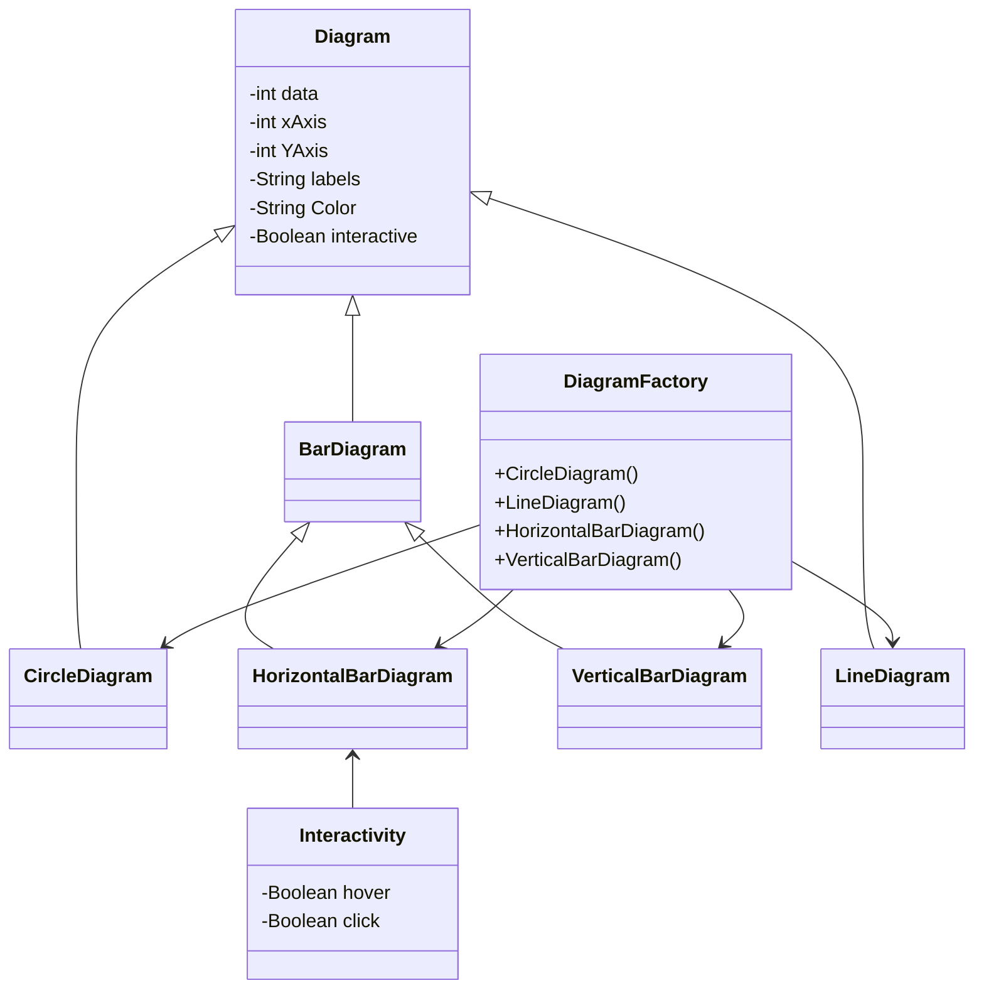

```mermaid
classDiagram

class DiagramFactory {
  +CircleDiagram()
  +LineDiagram()
  +HorizontalBarDiagram()
  +VerticalBarDiagram()
}

class Diagram {
  -int data
  -int xAxis
  -int YAxis
  -String labels
  -String Color
  -Boolean interactive
}

class CircleDiagram {
  
}

class BarDiagram {
  
}

class HorizontalBarDiagram {
  
}

class VerticalBarDiagram {
  
}

class LineDiagram {
  
}

class Interactivity {
  -Boolean hover
  -Boolean click
}

HorizontalBarDiagram <-- Interactivity

Diagram <|-- CircleDiagram
Diagram <|-- BarDiagram
Diagram <|-- LineDiagram

BarDiagram <|-- HorizontalBarDiagram
BarDiagram <|-- VerticalBarDiagram

DiagramFactory --> CircleDiagram
DiagramFactory --> LineDiagram
DiagramFactory --> HorizontalBarDiagram
DiagramFactory --> VerticalBarDiagram
```

## Design Thinking
Use SVG to create the diagrams and use the data to create the diagrams. The data will be passed as a parameter to the diagram class