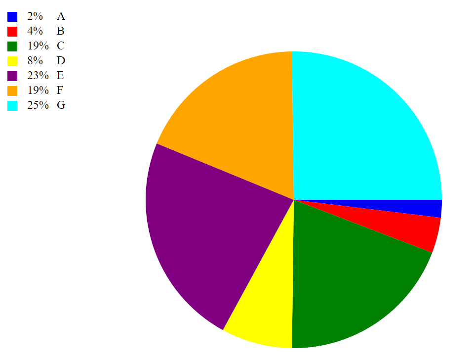

# Test Documentation

## Introduction
The purpose of this testing process is to thoroughly validate the functionality and reliability of the `DiagramFactory` library, which is intended for use on the client side. This library is responsible for generating a variety of diagram types, each with its unique data structure and visual representation, directly in the user's browser environment.

During this test phase, we will focus on verifying that the factory successfully generates each type of diagram it is designed to create, ensuring that all input data is accurately processed and correctly visualized in client-side environments. We will also assess how well the library performs across different browsers and devices, ensuring compatibility and responsiveness.

In addition, we will evaluate various configurations, including interactive elements, animations, colors, and labels, to ensure that the diagrams behave as expected. Special attention will be given to edge cases, such as invalid or missing data, to assess how the library handles error scenarios and maintains stability in a browser context.

## Test Environment

The application is designed to be tested in a web environment, specifically on the client side, within various browser platforms. The testing process includes both automated and manual tests to ensure a comprehensive validation of the DiagramFactory library.

### Technologies Used:
- JavaScript (JS): Core functionality for the DiagramFactory library.
- HTML & CSS: Structure and styling of the user interface.
- SVG (Scalable Vector Graphics): Rendering diagrams with resolution independence and interactivity.

### Automated Testing:
Automated tests are executed using the following tools and frameworks:

- Testing framework: Jest.

Automated tests are used to validate key functions of the library, including:

- Diagram generation
- Data input processing
- Error handling

### Manual Testing:
Manual tests focus on the user experience and interaction with the application. These include:

- Verifying diagram rendering and appearance in real-time across browsers
- Testing responsiveness and performance on different devices
- Verifying interactivity features (e.g., hover effects, animations)

### Browsers:
- Google Chrome (latest version)
- Mozilla Firefox (latest version)

### Devices:
- Desktop: High-resolution (1920x1080)
- Laptop: Standard resolution (1366x768)

Automated and manual testing combined ensures both functional accuracy and a seamless user experience across different platforms.

## Test Cases

### Automated Test Cases

A suite of automated tests was executed to validate the core functionality of the DiagramFactory library. These tests covered various aspects of diagram creation, data processing, error handling, and configuration options. The test suite included unit tests and integration tests.

- Total number of automated tests: 24
- Tests passed: 24
- Tests failed: 0

Key automated tests:

- **Test Diagram Creation**: Verified that all supported diagram types (bar, line, pie) are generated correctly.
- **Test Data Handling**: Ensured proper data processing, including edge cases like empty or malformed input.
- **Test Error Handling**: Confirmed that the system responds gracefully to invalid or missing data.

### Manual Test Cases

| Test Case ID | Description | Expected Result | Actual Result | Status |
|--------------|-------------|-----------------|---------------|--------|
| TC1 | Verify that the each diagram renders correctly. With minimum config. | Each diagram render correctly. | Each diagram renderd correctly. | Pass |
| TC2 | Verify that each diagram works with interactions. | All diagrams should show a infobox. The Line and HorizontalBarDiagram should also expand. | Each diagram have the ability to let users interact with it. | Pass |
| TC3 | Verify that Line and HorizontalBarDiagram works with decorations. | All Line and HorizontalBarDiagram should have decorations. | Both diagrams have decorations. And can be turned off | Pass |
| TC4 | Verify that the HorizontalBarDiagram works with animations. | The HorizontalBarDiagram should have animations. | The HorizontalBarDiagram have animations. | Pass


### **TC1**: Verify that each diagram renders correctly. With minimum config.
1. Place the svg element in the DOM.
```html
<svg id="svgDiagram" width="600" height="400"></svg>
```
2. In your javascript file, import the `DiagramFactory` OBS!!! Change `PATH_TO`.
```javascript
import { DiagramFactory } from './PATH_TO/DiagramFactory/DiagramFactory'
```
3. Create a new instance of the `DiagramFactory` class and set up the required Config.
```javascript
  const diagramFactory = new DiagramFactory({
    elementId: '#svgDiagram',
    data: [
      { label: 'A', value: 10, color: 'blue' },
      { label: 'B', value: 20, color: 'red' },
      { label: 'C', value: 100, color: 'green' },
      { label: 'D', value: 40, color: 'yellow' },
      { label: 'E', value: 120, color: 'purple' },
      { label: 'F', value: 96, color: 'orange' },
      { label: 'G', value: 130, color: 'cyan' }
    ]
  })
```
4a. Render the HorizontalBarDiagram.
```javascript
  diagramFactory.createHorizontalBarDiagram()
```
### Expected Result
The HorizontalBarDiagram should display bars corresponding to the input data.


4b. Render the LineDiagram.
```javascript
  diagramFactory.createLineDiagram()
```
### Expected Result
The LineDiagram should display lines corresponding to the input data.


4c. Render the CircleDiagram.
```javascript
  diagramFactory.createCircleDiagram()
```
### Expected Result
The CircleDiagram should display circles corresponding to the input data.



### **TC2**: Verify that each diagram works with interactions.

1. Place the svg element in the DOM.
```html
<svg id="svgDiagram" width="600" height="400"></svg>
```
2. In your javascript file, import the `DiagramFactory` OBS!!! Change `PATH_TO`.
```javascript
import { DiagramFactory } from './PATH_TO/DiagramFactory/DiagramFactory'
```
3. Create a new instance of the `DiagramFactory` class and set up the required Config.
```javascript
  const diagramFactory = new DiagramFactory({
    elementId: '#svgDiagram',
    data: [
      { label: 'A', value: 10, color: 'blue' },
      { label: 'B', value: 20, color: 'red' },
      { label: 'C', value: 100, color: 'green' },
      { label: 'D', value: 40, color: 'yellow' },
      { label: 'E', value: 120, color: 'purple' },
      { label: 'F', value: 96, color: 'orange' },
      { label: 'G', value: 130, color: 'cyan' }
    ], 
    interactive: {
      showInfoBox: true,
      expand: true
    }
  })
```

4a. Render the HorizontalBarDiagram.
```javascript
  diagramFactory.createHorizontalBarDiagram()
```
### Expected Result
The HorizontalBarDiagram should display bars corresponding to the input data. When hovering over a bar, an info box should appear with the data value. The bar should expand when hover.


4b. Render the LineDiagram.
```javascript
  diagramFactory.createLineDiagram()
```

### Expected Result
The LineDiagram should display lines corresponding to the input data. When hovering over a circle, an info box should appear with the data value. The circle should expand when hover.


4c. Render the CircleDiagram.
```javascript
  diagramFactory.createCircleDiagram()
```

### Expected Result
The CircleDiagram should display circles corresponding to the input data. When hovering over a circle, an info box should appear with the data value.


### **TC3**: Verify that Line and HorizontalBarDiagram works with decorations properties.

1. Place the svg element in the DOM.
```html
<svg id="svgDiagram" width="600" height="400"></svg>
```
2. In your javascript file, import the `DiagramFactory` OBS!!! Change `PATH_TO`.
```javascript
import { DiagramFactory } from './PATH_TO/DiagramFactory/DiagramFactory'
```
3. Create a new instance of the `DiagramFactory` class and set up the required Config.
```javascript
  const diagramFactory = new DiagramFactory({
    elementId: '#svgDiagram',
    data: [
      { label: 'A', value: 10, color: 'blue' },
      { label: 'B', value: 20, color: 'red' },
      { label: 'C', value: 100, color: 'green' },
      { label: 'D', value: 40, color: 'yellow' },
      { label: 'E', value: 120, color: 'purple' },
      { label: 'F', value: 96, color: 'orange' },
      { label: 'G', value: 130, color: 'cyan' }
    ], 
    decoration: {
      showGrid: false
    }
  })
```

4a. Render the HorizontalBarDiagram.
```javascript
  diagramFactory.createHorizontalBarDiagram()
```
### Expected Result
The HorizontalBarDiagram should display bars corresponding to the input data. The grid should not be visible.


4b. Render the LineDiagram.
```javascript
  diagramFactory.createLineDiagram()
```

### Expected Result
The LineDiagram should display lines corresponding to the input data. The grid should not be visible.


### **TC4**: Verify that the HorizontalBarDiagram works with animations.

1. Place the svg element in the DOM.
```html
<svg id="svgDiagram" width="600" height="400"></svg>
```
2. In your javascript file, import the `DiagramFactory` OBS!!! Change `PATH_TO`.
```javascript
import { DiagramFactory } from './PATH_TO/DiagramFactory/DiagramFactory'
```
3. Create a new instance of the `DiagramFactory` class and set up the required Config.
```javascript
  const diagramFactory = new DiagramFactory({
    elementId: '#svgDiagram',
    data: [
      { label: 'A', value: 10, color: 'blue' },
      { label: 'B', value: 20, color: 'red' },
      { label: 'C', value: 100, color: 'green' },
      { label: 'D', value: 40, color: 'yellow' },
      { label: 'E', value: 120, color: 'purple' },
      { label: 'F', value: 96, color: 'orange' },
      { label: 'G', value: 130, color: 'cyan' }
    ],
    animation: {
      speed: 100
    }
  })
```
4a. Render the HorizontalBarDiagram.
```javascript
  diagramFactory.createHorizontalBarDiagram()
```

### Expected Result
The HorizontalBarDiagram should display bars corresponding to the input data. The bars should animate when rendered.


## Known Issues
While no critical issues were found during testing, the following areas may benefit from further investigation:
- Performance on mobile devices has not been tested and should be evaluated for responsiveness and usability.

## Bug Reports
| Issue ID | Description | Status | Priority | Remarks |
|----------|-------------|--------|----------|---------|
| BUG001 | The CircleDiagram does not have the ability to expand. | open | minor | Requires update to interaction logic |
| BUG002 | The Labels does not fit good with the circle diagram when the space is to small | open | minor | Suggest resizing or using smaller labels |

## Conclusion

The testing process for the `DiagramFactory` library was successful, with all automated and manual tests passing. The library demonstrated robust functionality in generating various types of diagrams, handling data processing, and providing interactive features. The tests also confirmed that the library is compatible with different browsers and devices, ensuring a consistent user experience.

No critical bugs were identified, and all expected functionalities performed as intended. However, it is recommended that further testing be conducted on mobile devices and in additional browsers (Safari, Microsoft Edge) to ensure broader compatibility.